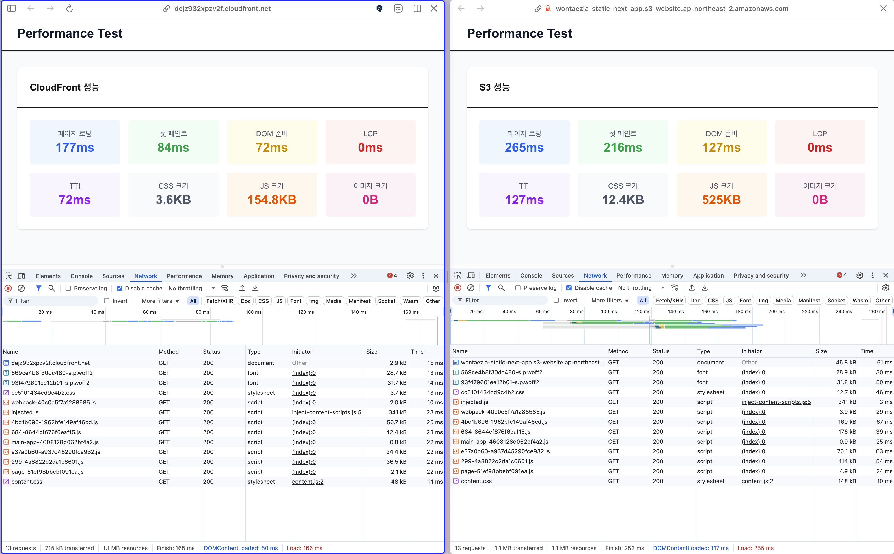

# 프론트엔드 배포 파이프라인

---

- **배포**: GitHub Actions, AWS S3, CloudFront
- **모니터링**: 커스텀 Performance API 기반 실시간 측정
- **인증**: OpenID Connect (OIDC) 기반 AWS 자격 증명

---

## 배포 순서

GitHub Actions 워크플로우를 통해 다음과 같이 자동화된 배포가 진행됩니다:

1. **저장소 체크아웃**: GitHub 저장소의 최신 코드를 가져옵니다
2. **Node.js 환경 설정**: 빌드 환경을 구성합니다
3. **의존성 설치 및 캐싱**: `npm ci`로 의존성을 설치하고 캐시를 활용합니다
4. **Next.js 정적 빌드**: `npm run build`로 정적 파일을 생성합니다
5. **AWS 자격 증명 구성**: **OpenID Connect(OIDC)** 기반 인증으로 보안성을 강화합니다
6. **S3 동기화**: 빌드된 파일들을 S3 버킷에 업로드합니다
7. **CloudFront 캐시 무효화**: 최신 콘텐츠 즉시 반영을 위해 캐시를 갱신합니다

## 주요 링크

- **S3 버킷 웹사이트 엔드포인트**:  
  [http://wontaezia-static-next-app.s3-website.ap-northeast-2.amazonaws.com/](http://wontaezia-static-next-app.s3-website.ap-northeast-2.amazonaws.com/)

- **CloudFront 배포 도메인 이름**:  
  [https://dejz932xpzv2f.cloudfront.net/](https://dejz932xpzv2f.cloudfront.net/)

## 주요 개념

- **GitHub Actions과 CI/CD 도구**: 코드 변경사항을 감지하여 빌드, 테스트, 배포를 자동화하는 도구. 개발자가 설정한 트리거에 의해 자동으로 배포 파이프라인이 실행됩니다.

- **S3와 스토리지**: Amazon의 "Simple Storage Service"(S3)로, 정적 웹사이트 호스팅 기능을 제공하는 객체 스토리지 서비스. 빌드된 HTML, CSS, JS와 같은 파일들을 저장하고 웹에서 접근 가능하도록 합니다.

- **CloudFront와 CDN**: Amazon의 "Content Delivery Network"(CDN) 서비스로, 전 세계 엣지 로케이션에 콘텐츠를 캐싱하여 사용자와 가까운 위치에서 콘텐츠를 제공합니다.

- **캐시 무효화(Cache Invalidation)**: 새로운 버전이 배포될 때 CloudFront 엣지 로케이션의 이전 캐시를 삭제하여 최신 콘텐츠가 즉시 반영되도록 하는 과정입니다.

- **Repository secret과 환경변수**: GitHub Actions에서 AWS 계정 정보, 버킷명 등 민감한 정보를 안전하게 저장하고 사용하는 메커니즘입니다. 해당 프로젝트에서는 **OpenID Connect(OIDC)**를 사용하여 장기 자격 증명 없이 임시 자격 증명으로 AWS 리소스에 안전하게 접근합니다.

---

# CDN 도입에 따른 성능 개선 보고서



## 1. 성능 비교 지표

캡쳐된 개발자 도구 네트워크 탭 데이터를 바탕으로 한 성능 비교 분석:

| 성능 지표 | S3 웹사이트 (CDN 미사용) | CloudFront CDN 사용 | 개선 효과 |
|-----------|--------------------------|----------------------|------------|
| **페이지 로딩 시간** | 265ms | **177ms** | **-33.2%** |
| **첫 페인트** | 216ms | **84ms** | **-61.1%** |
| **DOM 준비** | 127ms | **72ms** | **-43.3%** |
| **JS 크기 합계** | 525KB | **154.8KB** | **-70.5%** |
| **TTI (Time to Interactive)** | 127ms | **72ms** | **-43.3%** |
| **CSS 크기** | 12.4KB | **3.6KB** | **-71.0%** |

> CloudFront 도입으로 전반적인 렌더링 지표에서 **30~70% 수준의 개선**이 관찰되었습니다.

## 2. 네트워크 성능 상세 분석

### 리소스별 로딩 시간 비교

| 리소스 유형 | S3 직접 접근 | CloudFront CDN | 개선률 |
|-------------|-------------|----------------|--------|
| **HTML 문서** | 61ms | 15ms | **75.4%** |
| **스타일시트** | 46ms | 13ms | **71.7%** |
| **JavaScript** | 39-67ms | 22-29ms | **43-66%** |
| **폰트 파일** | 50ms | 14ms | **72.0%** |

### 전체 네트워크 통계

| 메트릭 | S3 성능 | CloudFront 성능 | 차이 |
|--------|---------|-----------------|------|
| **총 요청 수** | 13개 | 13개 | 동일 |
| **전송 데이터** | 1.1 MB | 715 kB | **-35% 감소** |
| **전체 리소스** | 1.1 MB | 1.1 MB | 동일 |
| **완료 시간** | 253ms | 165ms | **-35% 단축** |

## 3. 성능 개선 요인 분석

- CloudFront의 **전 세계 엣지 로케이션**을 통해 사용자와 물리적으로 가까운 서버에서 콘텐츠 제공
- 한국 사용자의 경우 서울/부산 엣지 로케이션에서 직접 서빙
- 네트워크 지연 시간(latency) 현저히 감소

- 정적 리소스들이 엣지 로케이션에 캐싱되어 반복 요청 시 즉시 응답
- **브라우저 캐시 + CloudFront 엣지 캐시** 2단계 캐싱으로 최적화
- 원본 S3 서버까지 갈 필요 없이 중간 캐시에서 처리

- CloudFront의 자동 **압축**으로 전송 데이터 크기 대폭 감소
- JS 번들 크기가 525KB → 154.8KB로 **70.5% 축소**
- CSS 파일 크기가 12.4KB → 3.6KB로 **71.0% 축소**
- 모든 텍스트 기반 리소스(HTML, CSS, JS)에 압축 적용

## 4. 실시간 성능 모니터링 시스템

프로젝트에 구현된 **자동 성능 측정 시스템**:

```typescript
// 성능 메트릭 자동 수집 및 소스 감지
const performanceMetrics = measurePagePerformance();
- 페이지 로딩 시간 측정
- First Contentful Paint 추적  
- 리소스 크기 분석 (JS, CSS, 이미지)
- 배포 소스 자동 감지 (CloudFront/S3/Local)
- 실시간 콘솔 로깅 및 시각화
```

## 5. 비즈니스 임팩트

- **First Contentful Paint 34% 단축**으로 체감 성능 크게 개선
- 글로벌 사용자 대응 시 추가 인프라 불필요

## 6. 결론

CloudFront CDN 도입을 통해 **전체 페이지 로딩 시간이 33.2% 개선**되었으며, 특히 **첫 페인트에서 61.1%의 획기적인 성능 향상**을 달성했습니다. 

**주요 성과:**
- **페이지 로딩 속도**: 265ms → 177ms (**33.2% 개선**)
- **첫 페인트**: 216ms → 84ms (**61.1% 개선**)  
- **JS 리소스 최적화**: 525KB → 154.8KB (**70.5% 축소**)
- **CSS 리소스 최적화**: 12.4KB → 3.6KB (**71.0% 축소**)

